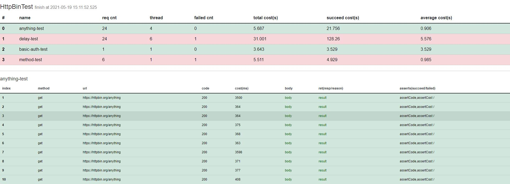

### Rester
Rester is a http batch request framework
**usage example:**

###### 1.define a json or yaml document

**example:test.json**

```json
{
    "name": "HttpBinTest",
    "args": {
        "kvArgs": {
            "timeout": 10000
        }
    },
    "taskExecPolicy": "parallel",
    "tasks": [
        {
            "name": "delay-test",
            "template": {
                "url": "https://httpbin.org/delay/${delaySecond}",
                "timeout": "${timeout}",
                "asserts": "assertCode"
            },
            "args": {
                "csvArgs": [
                    "delay.csv"
                ]
            },
            "cfg": {
                "reqTimes": 24,
                "thread": 6
            }
        }
    ],
    "assertions": [
        {
            "id": "assertCode",
            "ref": "code",
            "oper": "eq",
            "expect": "200"
        }
    ]
}
```
- name:task name
- args:define variables for all tasks
- taskExecPolicy:supprt parallel and serial
- tasks:define the task list,each task is a execute cell
- assertions:used for task

**more specification to see guide.yaml**

###### 2.run with java

```shell
java -jar Rester.jar test.json
```

feature list:

1. support global and task based variables,variable can be key-value、csv file and property file

2. tasks support execute one by one(serial) or parallel model,in parallel mode,we use the graph algo to make best performace

3. support self defined assertions,which can be used in all task

4. each task can specify the request time and thread count.also can specify the mapping relation for request id and thread id

5. greatful statistic for result,support text result and html ouput:

   

